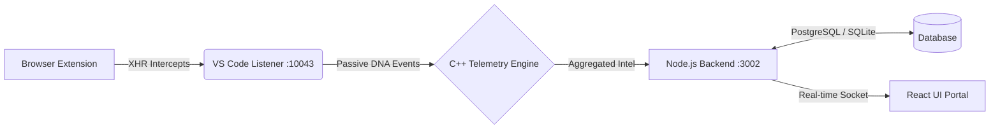

<div align="center">
  

  <br />
  <br />

  <h1>myCPC | The AI-Native Competitive Programming Gym</h1>

  <p>
    <strong>A full-stack telemetry, algorithmic coaching, and behavioral tracking ecosystem designed to synthetically reconstruct and optimize the cognitive process of elite competitive programmers.</strong>
  </p>

  <p>
    <a href="https://github.com/Dev-By-Varshith/myCPC/actions"></a>
    <a href="#"></a>
    <a href="#"></a>
    <a href="#"></a>
  </p>
</div>

<hr />

## 📖 Table of Contents

- [Overview](#-overview)
- [System Architecture](#-system-architecture)
- [Telemetry & DNA Mapping](#-telemetry--dna-mapping)
- [Directory Structure](#-directory-structure)
- [Prerequisites](#-prerequisites)
- [Environment Setup](#-environment-setup)
- [Confidentiality Protocols](#-confidentiality-protocols)

---

## 🎯 Overview

**myCPC** is not just another competitive programming platform. It is a deeply integrated, highly sensitive telemetry pipeline that actively monitors a programmer's flow state, debugging cycles, and submission habits across platforms like Codeforces, AtCoder, CodeChef, and CSES. By combining a C++ telemetry engine with a React-based frontend and a Node.js API ecosystem, it provides unparalleled analytical depth into user behavioral friction and algorithmic DNA.

---

## 🏛 System Architecture

The ecosystem relies on an asynchronous, multi-agent architecture designed to intercept network payloads and IDE keystrokes with minimal computational overhead.



### Core Components

1. **The C++ Telemetry Engine (`/engine`)**: High-performance module that compiles to a Node.js native addon. Evaluates time-series keystroke data, detects "Tilt" (rapid-fire guessing), and executes Monte Carlo simulations for expected performance ratings.
2. **VS Code Extension (`/extension`)**: A lightweight IDE bridge that captures editor states, stress test results, and compiler errors in real-time.
3. **Chrome Network Injector (`/chrome-extension`)**: Silently hooks into judge APIs to track passive events, problem statements, and real-time contest standings.
4. **Data Intake API (`/backend`)**: Centralized processing node handling JWT authentication, rating classification, and webhook ingestion.
5. **Dashboard (`/frontend`)**: A visually stunning, dashboard-driven React application mapping out the user's algorithmic skill graph and upsolve queue.

---

## 🧬 Telemetry & DNA Mapping

The core defining feature of myCPC is its **Algorithmic DNA Mapping**. Standard platforms track whether a problem was solved. myCPC tracks *how* it was solved.

- **Tilt Tracking**: Automatically detects emotional frustration (e.g., submitting 3+ times within 120 seconds with compilation or sample failures) and calculates average recovery time.
- **Friction Analysis**: Logs exactly which line of code caused the longest pause in typing.
- **Ghost Arena**: Matches the user's live coding speed against historic competitors in real-time.

---

## 📂 Directory Structure

```text
myCPC/
├── backend/             # Node.js Express API and Authentication layer
├── chrome-extension/    # Browser extension for intercepting Judge platforms
├── engine/              # C++ Native module for complex telemetry logic
├── extension/           # VS Code extension for IDE state tracking
├── frontend/            # React/Vite web application UI
├── infra/               # Cloudflare Workers, Docker, and Database schemas
├── .github/             # CI/CD workflows and repository assets
├── CONTRIBUTING.md      # Strike Team PR protocols
└── COPYRIGHT.md         # Legal bounds and confidentiality agreement
```

---

## ⚙️ Prerequisites

To deploy the ecosystem locally, the Strike Team must ensure the following runtime dependencies are met:

- **Node.js**: `v20.0.0` or higher (Strictly enforced)
- **NPM**: `v10.x.x` or higher
- **C++ Toolchain**: `GCC/Clang` or `MSVC` for compiling the Telemetry Engine
- **CMake**: `v3.20+` for engine bindings

---

## 🚀 Environment Setup

### 1. Initialize the Backend
```bash
cd backend
cp .env.example .env
npm ci
npm start
```
*The API will mount on `http://localhost:3002`.*

### 2. Launch the IDE Telemetry Bridge
```bash
cd extension
cp .env.example .env
npm ci
```
*Open in VS Code, and press `F5` to spin up the Extension Development Host.*

### 3. Start the Web Portal
```bash
cd frontend
cp .env.example .env
npm ci
npm run dev
```

### 4. Mount the Browser Extension
- Navigate to `chrome://extensions/`
- Enable **Developer Mode**
- Click **Load unpacked** and select the `chrome-extension/` directory.

---

## 🔒 Confidentiality Protocols

This repository operates under strict closed-source governance. By contributing, you agree to the terms outlined in `COPYRIGHT.md`. 

> **Warning**: Do not fork, duplicate, or publicly expose this codebase or its proprietary C++ engine logic. All feature branches must adhere to the `CONTRIBUTING.md` standards.

---
<div align="center">
  <i>Engineered for the 1%. Maintained by the Strike Team.</i>
</div>
